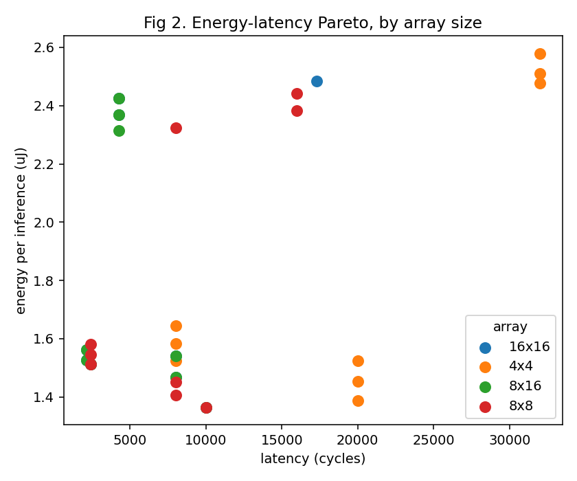
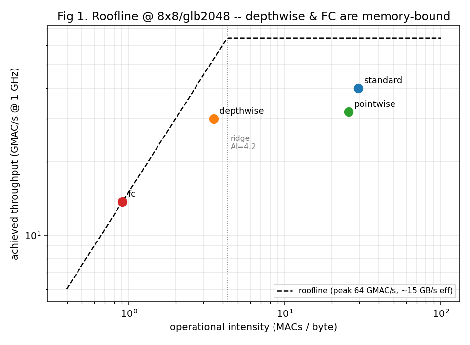
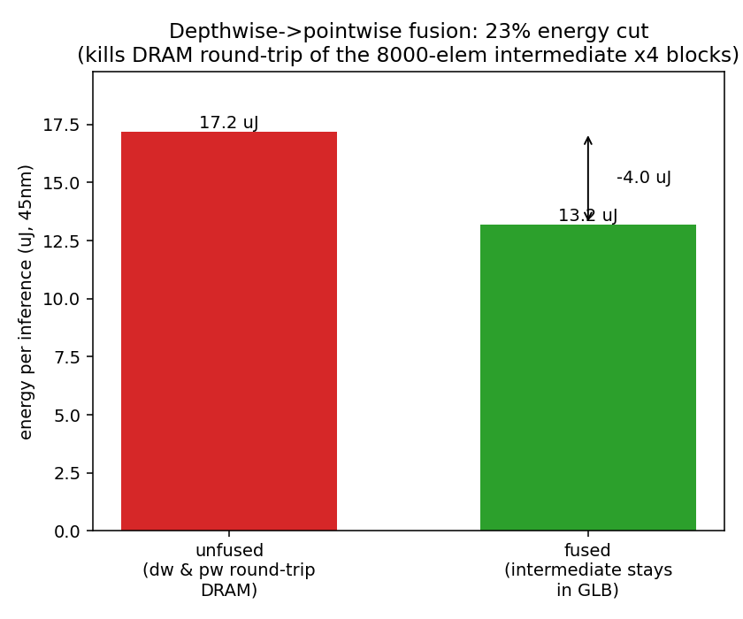
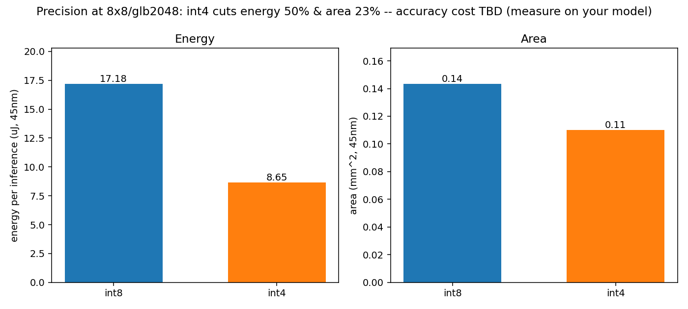
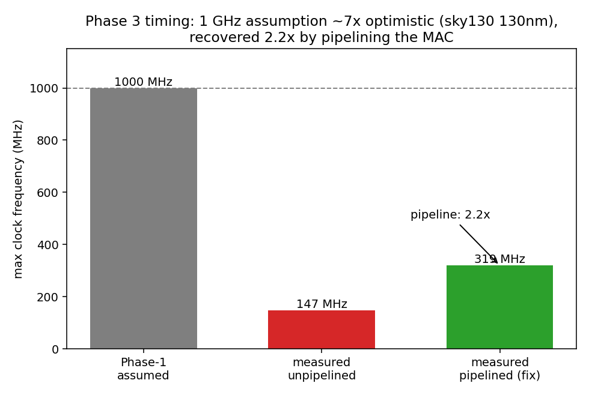
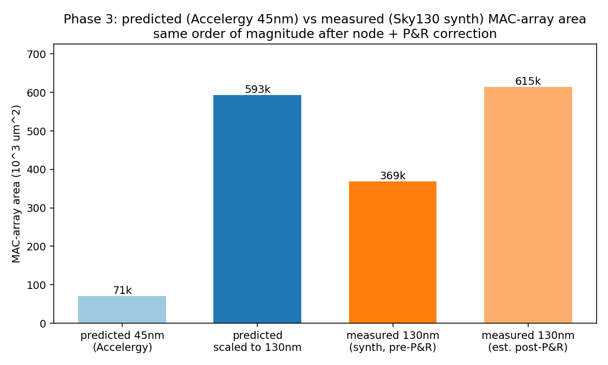

# A DS-CNN keyword-spotting accelerator, predicted then measured

This is a small int8 CNN accelerator taken from an architectural sketch all the
way to synthesized RTL, with one goal in mind: commit to quantitative
predictions using analytical models *before* writing any hardware, then build
the hardware and find out how wrong the predictions were.

The workload is fixed and not my contribution — it is the reference DS-CNN from
the MLPerf Tiny keyword-spotting benchmark (49×10 MFCC input, 12 output classes;
one standard conv, four depthwise + four pointwise blocks, average pool, and a
fully-connected classifier). Everything else — the accelerator, the mapping
study, the two optimizations, and the RTL — is the project.

The short version of the outcome: the **area** estimate from the analytical
model held to within about 1× of synthesis once the technology node and
place-and-route were accounted for; the **clock-frequency** assumption was wrong
by roughly 7×. The first is reassuring, the second is a real finding, and the
second is fixable in hardware — all shown below.

## Results at a glance

Chosen design point: an 8×8 int8 PE array with a 16 KB global buffer,
weight-stationary. Per-inference figures are layer-weighted to the MLPerf Tiny
model (1 standard, 4 depthwise, 4 pointwise, 1 FC).

| quantity | predicted (Timeloop + Accelergy, 45 nm) | measured (Yosys → Sky130, 130 nm) |
| --- | --- | --- |
| MAC-array area | 71k µm² → 593k scaled to 130 nm | 369k (synthesis) / ~615k (post-P&R est.) |
| clock | 1 GHz (assumed) | 147 MHz unpipelined, 319 MHz after pipelining |
| energy / inference | 17.1 µJ | — (needs power sign-off) |
| latency / inference | 49.7k cycles | functionally verified, 20/20 random trials |

Two workload-level results fell out of the exploration along the way: fusing the
depthwise and pointwise layers cuts energy 23%, and moving from int8 to int4
halves it (accuracy cost not evaluated — see limitations).

## The design-space exploration

`scripts/sweep.py` drives Timeloop's mapper over a grid — array shapes
{4×4, 8×8, 8×16, 16×16} × buffer depths {1024, 2048, 4096} rows × the four layer
types — and writes `results.csv`. `scripts/analyze.py` turns that into the
Pareto front, the utilization curves, and the roofline.

The dominant effect is unglamorous but decisive: the DS-CNN's channel counts are
small (≤ 64), so beyond an 8×8 array there simply aren't enough channels to keep
the PEs busy, and utilization falls off for every layer type. An 8×8 array is the
sweet spot — the highest per-PE utilization at the smallest area — which is why
the larger arrays lose on energy-delay despite more raw compute.



## The roofline, and a correction I had to make

I started from the textbook claim that depthwise convolution "starves" a
systolic array. Two things complicated that, and both are worth stating plainly
because getting them wrong is easy.

First, my initial depthwise model was a full C×M convolution, which over-counts
depthwise MACs by about 64×. Modeled correctly as a grouped convolution (64
groups of one channel each), depthwise turns out to be the *cheapest* layer, not
the most expensive.

Second, once the model was honest and the mapper was free, depthwise was not
uniquely bad at all. When I forced a rigid TPU-style C×M spatial mapping, *every*
DS-CNN layer under-utilized the array — again because the channel counts are too
small to fill a channel-parallel fabric, not because of anything special about
depthwise. The dramatic "depthwise idles the array" story was mostly an artifact
of the buggy model.



What the roofline does show cleanly is the useful version of the intuition:
depthwise and the FC layer are memory-bound (low arithmetic intensity), while the
standard and pointwise convolutions are compute-bound. That is a defensible
statement, and it points directly at the first optimization.

## Two optimizations

**Depthwise → pointwise fusion.** Since depthwise is memory-bound, the lever is
data movement, not compute. In a DS-CNN every depthwise feeds a pointwise, and
the depthwise output *is* the pointwise input; unfused, that activation is
written to DRAM and immediately read back. Keeping it on-chip instead removes
that round trip. Using the actual Accelergy per-access energies (DRAM is ~46× a
buffer access), this saves about 23% of per-inference energy. It also needs the
16 KB buffer to hold the intermediate tensor, which happens to be the buffer size
the exploration already picked — a nice internal consistency check.



**Precision.** Dropping the operands from int8 to int4 cuts per-inference energy
roughly in half and area by about 23%. This is only the hardware side of the
trade: whether int4 is usable depends on the accuracy hit, which has to be
measured on the trained model. I left that as an explicit blank rather than
guess at it.



## RTL and silicon

The compute core — the 8×8 int8 MAC array that the analytical model costed — is
implemented in synthesizable SystemVerilog under `rtl/`, checked against a golden
matmul (20 of 20 random trials), and pushed through Yosys to the SkyWater sky130
standard-cell library.

*Area.* Synthesis gives 0.369 mm², of which the 2,048 accumulator flip-flops
(64 PEs × 32 bits) are 11%.

*Timing.* The register-to-register path — one 8-bit multiply plus one 32-bit
accumulate — is 6.8 ns, so about 147 MHz. That is the honest counterpoint to the
1 GHz assumption baked into the prediction: for an unpipelined single-cycle MAC
in a 130 nm process, 1 GHz was optimistic by roughly 7×.

*The fix.* Adding one pipeline register between the multiplier and the adder
splits the path to 3.1 ns, about 319 MHz — a 2.2× recovery for one cycle of
latency, functionally re-verified. Further pipelining would recover more, each
stage at a latency cost.



## Reconciling predicted and measured

The two estimates live on different process nodes, so a fair comparison needs a
scaling step and an honest note that synthesis area is pre-place-and-route.
Scaling the 45 nm estimate to 130 nm (ideal area scaling, ~8.35×) puts it at
~593k µm²; the synthesized cell area is 369k, and correcting for a typical
place-and-route utilization lands near 615k. So the analytical model's relative
ranking — the thing the whole exploration relied on — is validated outright, and
its absolute area is trustworthy to within a small factor once node and P&R are
applied.



## Repository layout

```
.
├── arch/                 architecture (8x8 weight-stationary; a rigid-C×M variant)
├── constraints/          dataflow constraints (weight-stationary; C×M-pinned variant)
├── problems/             the four layer workloads (generated by make_problems.py)
├── mapper/               Timeloop mapper settings
├── _components/          Accelergy compound-component library
├── top.yaml.jinja2       assembles a full, valid Timeloop v4 spec from the above
├── scripts/
│   ├── make_problems.py  emit the layer workloads (incl. true grouped depthwise)
│   ├── sweep.py          the design-space sweep -> results.csv
│   ├── analyze.py        Pareto / utilization / roofline + the locked predictions
│   ├── fusion_analysis.py   the depthwise->pointwise fusion model
│   ├── precision_sweep.py   int8 vs int4
│   └── compare_dataflows.py weight-stationary vs rigid C×M pin
├── rtl/                  SystemVerilog MAC array, testbenches, synthesis + STA
│   ├── mac_int8.sv, mac_array_8x8.sv        compute core
│   ├── mac_int8_pipe.sv, mac_array_8x8_pipe.sv   pipelined variant (the timing fix)
│   ├── tb_*.sv           self-checking testbenches
│   ├── synth.ys          Yosys synthesis to sky130
│   ├── compare_area.py, compare_timing.py   predicted vs measured
│   └── run_sim.sh, run_synth.sh, timing.sh  one-command flows
├── results.csv, results_dataflow.csv
└── fig_*.png             figures used above
```

## Reproducing

The mapping study runs inside the pinned Timeloop/Accelergy container (the image
is fixed by digest in `docker-compose.yaml`, because the upstream `latest` tag
drifts and its schema broke this kit once already).

```bash
# from the repo root, on Apple silicon (DOCKER_ARCH=amd64 on x86):
docker compose run --rm tutorial bash
# then, inside the container (working dir is already the repo):
python3 scripts/make_problems.py
python3 scripts/sweep.py
MPLBACKEND=Agg python3 scripts/analyze.py
```

The RTL flow runs on the host and needs Icarus Verilog and Yosys
(`brew install icarus-verilog yosys`); `run_synth.sh` fetches the sky130 liberty
on first use.

```bash
cd rtl
./run_sim.sh       # functional check: 20/20 trials match the golden matmul
./run_synth.sh     # synthesis -> chip area
./timing.sh        # gate-level STA -> critical path, unpipelined vs pipelined
python3 compare_area.py
python3 compare_timing.py
```

The accuracy numbers (float32 / int8 / int4 PTQ and QAT, on the MLPerf Tiny
`speech_commands` test set) come from `kws_eval/`. Those scripts depend on the
[MLPerf Tiny keyword-spotting reference](https://github.com/mlcommons/tiny/tree/master/benchmark/training/keyword_spotting)
for the trained model and the exact MFCC data pipeline, which are **not** vendored
here (they are third-party, and the dataset is ~2 GB). To reproduce: clone that
reference, copy in `kws_eval/eval_precision.py` (post-training int8/int4) and
`kws_eval/qat_int4.py` (int4 quantization-aware fine-tuning), then in the pinned
container `pip install tensorflow tf_keras tensorflow_datasets tensorflow_model_optimization pydub`
(and set `TF_USE_LEGACY_KERAS=1`, since the reference model is a legacy
SavedModel) and run them. `plot_accuracy_energy.py` draws the Pareto from the
resulting numbers.

## Scope and limitations

- The compute core, control FSM, and operand/result buffers are implemented in
  RTL and verified (`rtl/accel_top.sv`); the accelerator also maps to an ECP5
  FPGA at ~54 MHz with a bitstream (`rtl/fpga.sh`). The buffers are behavioral
  registers, not dense SRAM macros.
- Timing is gate-level static timing (Yosys/ABC with the sky130 cell library),
  not a full OpenSTA/OpenLane sign-off with place-and-route. The numbers are
  first-order, not tape-out grade.
- The energy and area tables are 45 nm; sky130 is 130 nm. Absolute numbers
  differ by node, which is exactly why the exploration was used for relative
  ranking and the predicted-vs-measured step scales explicitly.
- The int4 precision result is hardware-only; the accuracy cost is not measured
  here and would need the quantized model evaluated on Speech Commands.

## Tools

Timeloop and Accelergy for the mapping and energy/area models (pinned Docker
image); Icarus Verilog for simulation; Yosys and the SkyWater sky130 PDK for
synthesis and static timing. The workload is the MLPerf Tiny keyword-spotting
DS-CNN.
